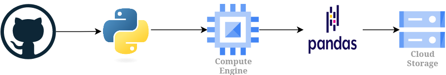

# py-4

## **Sobre**

Este projeto cria um processo simples de ETL e utiliza:

1. API do Github para obter os 30 projetos do GitHub mais bem avaliados (com mais estrelas) que usam Rust ou C ou Assembly, assim como foi feito no projeto py-2;

2. Compute Engine (GCP) para criação de uma instância de uma máquina virtual ([e2-micro](https://cloud.google.com/compute/docs/general-purpose-machines#e2_machine_types)) com [debian](https://cloud.google.com/compute/docs/images/os-details#general-info) para processar os dados utilizando a biblioteca [pandas](https://pandas.pydata.org/);

3. Cloud Storage (GCP) para armazenar o arquivo final (`.csv`) em um bucket.

## **Arquitetura**



## **Utilização**

Para executar o processo pode-se utilizar uma instância do Cloud Shell ou executar localmente por meio do [Google Cloud CLI](https://cloud.google.com/sdk/docs/install?hl=pt-br), e seguir os passos:

1. Alterar o arquivo de configuração `config.json`:
    - `"bucket_name"`:   Colocar o nome do bucket desejado;
    - `"target_folder"`: Colocar o nome do diretório de destino (pode deixar como `null` ou vazio `""`);
    - `"csv_file_name"`: Colocar o nome do arquivo csv.

2. Dar permissão para execução do arquivo `main.sh`:

    ```Bash
    chmod +x main.sh
    ```

3. Executar o arquivo `main.sh` com os parâmetros para o nome da VM (`VM_NAME`), id do projeto (`PROJECT_ID`) e a zona da VM (`ZONE`). Exemplo:

    ```Bash
    ./main minha_vm meu-project-id us-central1-b
    ```

**OBS.:** Para esse projeto serão instaladas as bibliotecas `requests`, `pandas` e `gcsfs` na VM via `pip` (`dependencies.sh`), logo após a criação da instância da VM.